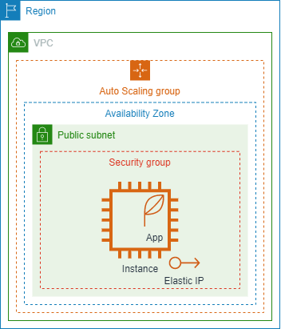
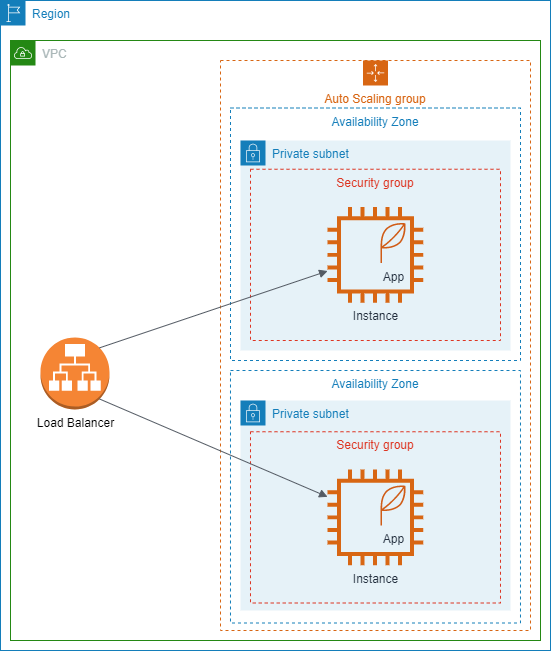

# Elastic Compute Cloud (EC2)

EC2 is the workhorse of AWS and it's a good one. Lately, other services which abstract EC2 tend to be used/recommended more (Elastic Beanstalk, Lightsail, Fargate and others) however, having some experience with it will help you tremendously when working with other services and to better understand your architecture.

The service ranges from very simple, where we just launch an instance and perform all the tasks manually by ssh-ing into it, to highly sophisticated where we can configure auto-scaling groups based on custom AMIs behind load balancers while reducing costs by leveraging spot instances and savings plans (which supersede reserved instances in some ways, but not in others).

## EC2 Instances

Before we launch our instance, let's discuss some important factors:

#### 1. Instance type (how big, for what and, of course, how much)

We can choose from a huge range of instance types. These types are just various pre-configured virtual machines.

If all we want is a server to handle usual web requests (CRUD operations, some business logic) we can start from the T family (t2/t3, called burstable. Don't worry too much about the bursting aspect unless you plan to have long-running CPU-intensive tasks) or from M family (medium) and choose a certain configuration based on the load we expect. We can start small, e.g. t2.micro, and upgrade it when needed - this is called **vertical scaling**.

#### 2. Networking (private or public?)

When creating an EC2 instance, we choose in which VPC it will reside. Also, based on the VPC, we can choose the subnet. This is what dictates the AZ where the instance will be and whether the instance is public or not (of course we can assign it to a public subnet and choose not to give it any public IP).

Just like with any other computer, the networking is handled by a (virtual) networking card called ENI (Elastic Networking Interface). So, if we want an instance with multiple IP addresses, we can simply attach multiple ENIs to it.

#### 3. Launch type (\$\$\$ related usually)

The default launch type is **on-demand**. You launch your instance whenever you want, stop/terminate it whenever you want and pay for the time you had it running (in seconds). We recommend it when getting started as choosing anything else would be premature optimization.

Then once, we get a feeling of our workloads and traffic, we can try to reduce the costs. For example we can commit to using the instance for the next 1 or 3 years and get a massive price cut (over 50%).

Also, there might be cases in which we have to run our system in a physically isolated environment (due to certain legal requirements maybe). In this case we would choose dedicated hosts launch type.

#### 4. Instance State

An instance can be in one of several states. The most important states are:

- **started** - Your instance is up and running and you are getting billed for every second
- **stopped** - Your instance is shut down (i.e. it doesn't have any CPU or RAM assigned). You are paying only for the storage (OS, your app etc.).
- **terminated** - You are done with the instance. You can choose what happens to the storage attached to the instance before it gets destroyed (do you want to keep it or also destroy it?)

## Storage

An instance is basically just some virtual CPU and memory. If we want to do anything with it, we need some storage. Of course, all of them are documented [in the AWS documentation](https://docs.aws.amazon.com/AWSEC2/latest/UserGuide/Storage.html), but in short we have the following options:

- **EBS** - You can see as an SSD/HDD (or even USB stick) that you can attach to an instance. It comes in [multiple options](https://docs.aws.amazon.com/AWSEC2/latest/UserGuide/ebs-volume-types.html), but in most cases, GP2 (general purpose) is enough. This is where the OS will be installed.
- Instance Store - Blazing fast storage that is physically attached to the host running the instance. It is intended only for temporary storage (**ephemeral** storage).
- **EFS** - You can see it as a network-attached storage. Multiple instances from multiple AZs can connect to it (the connection is handled by an ENI).

## User Data and AMIs

Whenever you launch an EC2 instance, you get a bare VM (it only has the OS and some other common tools installed). Of course, you can always ssh into the instance and setup your application and the other tools you need.

Even better, you can use **User Data**. It allows you to specify what to do when creating the instance (e.g. install nginx).

Once your machine is in the state that you want, you can create an **AMI** (Amazon Machine Image) from it which then can be used to create other identical instances without waiting for the initial installation. This is usually referred to as the Golden AMI.

## Auto Scaling Groups

They can be seen as managers of your instances. You tell them what kind of instance you want and how many, and the ASG handles the rest. In practice, it is always recommended to use auto-scaling groups even if you have just one instance.

## Load Balancers (ELBs)

The load balancer is usually the service that exposes our servers. We configure an ASG with a certain capacity (number of instances) and let the load balancer split the traffic between the instances. There are 2 types of ELBs:

- **Application** - This is an actual proxy between the internet and your application. It receives a request from a client and makes another request (with the same data) to your application. It offers tons of features and it suits very well most cases. One important tip about it is that since the ALB creates another request, but, for some reason, you need the IP address of the original client, you can look at the request header _x-forwarded-for_.
- **Network** - You can look at it like at a (very sophisticated) network router. While the ALB operates at layer 7 (HTTP, WebSockets) of the [OSI model](https://en.wikipedia.org/wiki/OSI_model), the NLB handles traffic at layer 4 (TCP/UDP) thus working with packets. You loose some features of the ALB, but gain massive performance (**and scalability**) and the request looks like it came directly from the original client. Also, interestingly enough, it is (slightly) cheaper than an ALB (mostly because you have to configure it more).
- There is a third option, classic, but it's deprecated.

ELBs offer tons of features which are great, but we won't go over them since setting up an ELB is such a rare task. However here are a few aspects to keep in mind:

- The ELB offers a static DNS name that you are supposed to use (as opposed to an IP address).
- It can be internet-facing or internal (we might need load balancing between various tiers or services of our system).
- The ELB can check the health of your instances and forward the traffic only if the instance seems to be running (in practice, your application would have an endpoint responsible for responding to health checks - only the status code of the response is relevant, usually HTTP 200).
- In case of an ALB, you can route traffic to different targets based on several URL components such as the hostname (_**a**.example.com_), path (_example.com/**a**_) and query strings (_example.com?**service=a**_).
- If, for some reason, requests must go to exactly the same instance, you can use sticky session (it shouldn't happen).

If you want to get a better understanding of how to setup up a load balancer, you can follow the [getting started guide](https://docs.aws.amazon.com/elasticloadbalancing/latest/application/application-load-balancer-getting-started.html) and, for an event deeper understanding, you can go through some [examples](https://exampleloadbalancer.com/).

## Architecture Samples

The simplest architecture (that still follows some principles) is the following:

In many cases this might be enough. However, if we wanted make our system highly available (i.e. reduce the chance it goes down due to various reasons) and/or improve its scalability (**horizontal scalability**), our architecture might look like the following image:

:::warning Question 1
How would you compare the architectures from a networking perspective? What is different?
:::

:::warning Question 2
Do you see any potential issue with our second architecture? (Think from a functional point of view)
:::

:::warning Exercise
**[Level 200]** Your task is to get a web application running on your own EC2 instance while following the simple architecture from above. If you completed the [spring training](https://github.com/ro-msg-spring-training/resources), you can try with that (you might have install additional software like the JDK or the RDMS). The aim is to be able to call your application from your browser/postman.

Tips: use git to pull the source code, use the connect button from the AWS console (you don't need to worry about the keypair - launch the instance without it) to ssh into your instance, don't forget about the security group for ssh and the port of your application.

Feel free to consult the [AWS Guide](https://docs.aws.amazon.com/AWSEC2/latest/UserGuide/EC2_GetStarted.html).
:::

:::warning Extra
**[Level 200]** Checkout [this video](https://www.youtube.com/watch?v=kMMybKqC2Y0) for a summary of most features that are part of EC2.
:::
