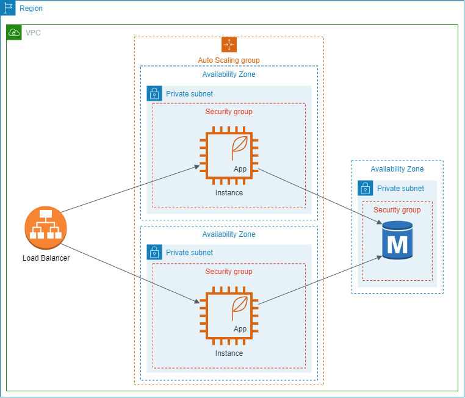

# Relational Database Service (RDS)

## What is it?

If your answer to the second question from the previous chapter is related to the database, good job. When working with a single server, we might choose to run the database on the same VM. While this might be enough for a while, we might quickly run into scalability issues.

One possible solution would be to deploy the RDBMS into a separate instance. This would add a clear separation between your application layer and the data layer thus allowing us to scale our application much easier, but we would still be responsible for managing the database (monitoring, updates, etc.).

Of course, AWS already thought about this so they came up with RDS. It is a service that enables us to create and run various RDBMS' (e.g. MySQL, Postgres - [complete list](https://aws.amazon.com/rds/)), while not having to worry about operational aspects. Internally, it is just an RDBMS running on an EC2 instance with sophisticated scripts. Of course, it is more expensive than running our own DB, but in the long run, it is the way to go.

Our architecture would look like this:

Perhaps the most important information from this chapter is how to secure your database. **The easiest approach is to protect it with a security group that only allows connections from the security group of your application tier.**

Another important tip is that you can reserve the RDS instance (just like EC2) to reduce the costs.

## Why Relational?

Before we go through some features of RDS, we must first be able to decide if we use RDS (i.e. a relational database). Relational databases are great for [OLTP](<https://database.guide/what-is-oltp/#:~:text=OLTP%20(Online%20Transactional%20Processing)%20is,a%20large%20number%20of%20users.>) as opposed to [OLAP](https://en.wikipedia.org/wiki/Online_analytical_processing). Take a quick look [here](https://www.guru99.com/oltp-vs-olap.html) to get an understanding of the differences between OLTP and OLAP.

Generally, relational databases are great because of their querying capabilities (you can build some truly sophisticated queries and joins) and [ACID](https://en.wikipedia.org/wiki/ACID) transactions. Interestingly enough, these are also the main causes of their limitations such as high CPU usage and scalability (they don't scale horizontally in general). However, it is a decent choice in most cases unless you are building the next Facebook. And, of course, your system might use several database types at once (use the right tool for the job).

**[Level 200]** For more information on how to choose the right database, check out [this amazing sales video](https://www.youtube.com/watch?v=hwnNbLXN4vA).

## Features

### 1. Automated back-ups

Well, they are great.

### 2. Read replicas

They can help with scalability issues for reading operations. The data is asynchronously replicated so there is a very small chance your clients don't see the latest data. You need to adapt your application in order to leverage the read replicas (i.e. connect to a different instance).

### 3. Multi-AZ

You can choose to run the database in several AZs at once. This helps with availability. If one AZ goes down, your connections are automatically switched to another AZ (i.e. you don't have to adapt your application).

For more information regarding multi-AZ and read replicas check out [this](https://aws.amazon.com/rds/features/read-replicas/).

### 4. Monitoring

You can monitor a lot of metrics from your instance including. See [this](https://docs.aws.amazon.com/AmazonRDS/latest/UserGuide/CHAP_Monitoring.html) for a complete list and to get an idea on how you can analyze and optimize your queries, see [this](https://aws.amazon.com/blogs/database/optimizing-and-tuning-queries-in-amazon-rds-postgresql-based-on-native-and-external-tools/).

###

:::warning Exercise
**[Level 250]** For a complete tutorial on how to set up an RDS instance and a webserver which connects to it together with all the networking and security that it involves, you can check [this one](https://docs.aws.amazon.com/AmazonRDS/latest/UserGuide/TUT_WebAppWithRDS.html) (**use t2.micro instead of the suggested t2.small to stay in the free tier**).
:::

:::warning Exercise
**[Level 300]** Describe the previously created infrastructure using CDK. You can google some examples or you can take a look at the CDK documentation for [EC2](https://docs.aws.amazon.com/cdk/api/latest/docs/aws-ec2-readme.html) and [RDS](https://docs.aws.amazon.com/cdk/api/latest/docs/aws-rds-readme.html).
:::
